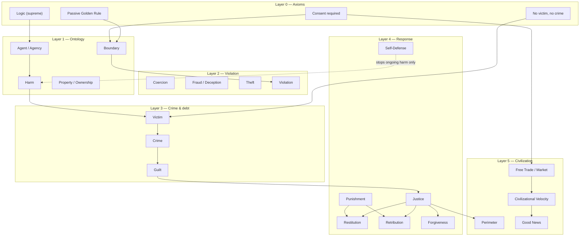
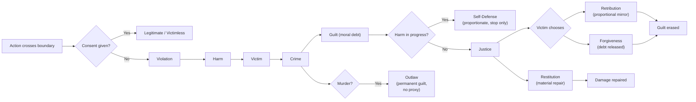
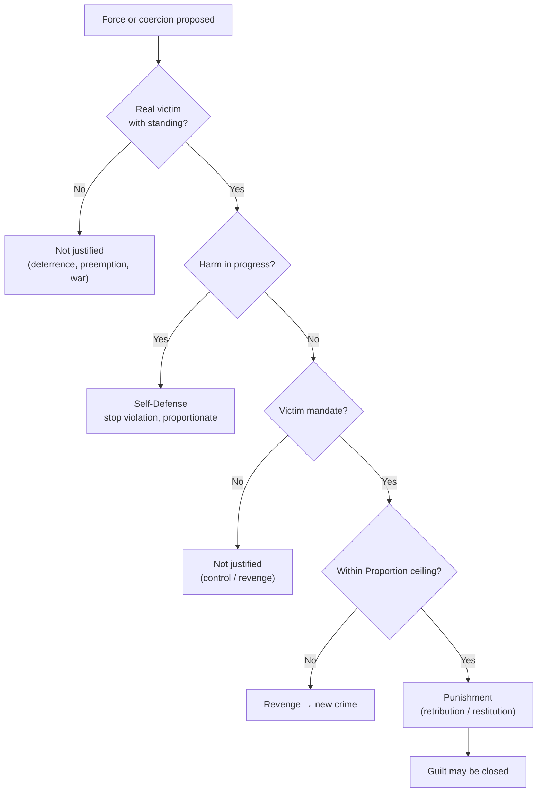
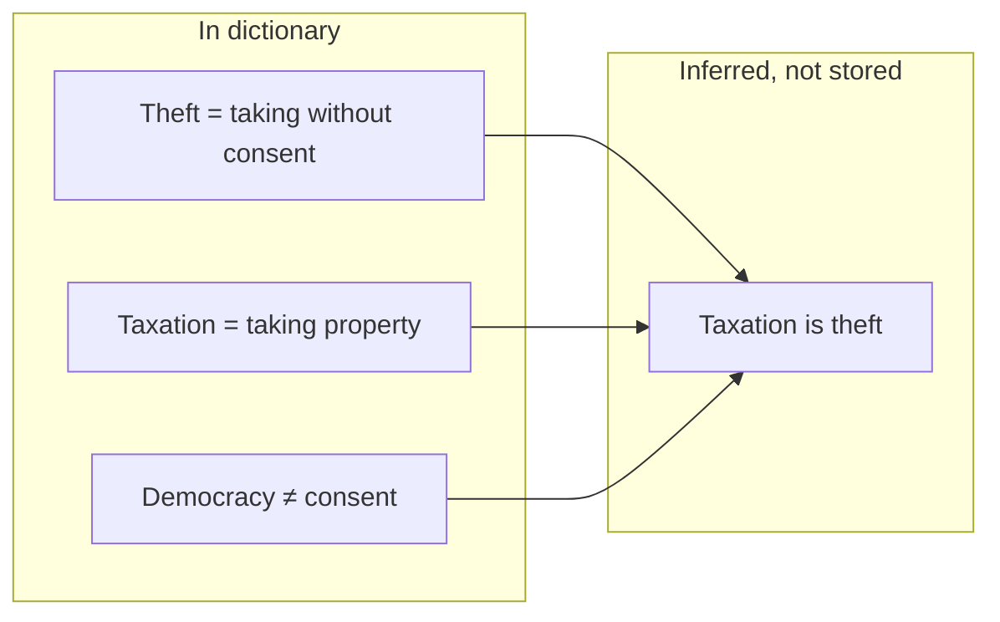

# Dictionary Structure

Visual map of the [Coherent Dictionary of Simple English](../dictionary/coherent-dictionary-of-simple-english.txt) — how terms stack, flow, and connect.

**Interactive explorer:** open [`visualization/output/index.html`](../visualization/output/index.html) in a browser (or run `python3 -m http.server` from `visualization/output/`).

**Regenerate graphs:** `python3 visualization/generate_graph.py`

---

## 1. Layered stack

What rests on what. Four axioms at the base; everything else derives.



---

## 2. Justice pipeline

How a boundary crossing becomes crime, debt, and response.



---

## 3. Coercion decision tree

When force or coercion is morally permitted.



---

## 4. Concept cluster map

~187 terms grouped into navigable clusters (see interactive viewer for full graph).

```
                    [ Logic · Reason · Truth · Error ]
                                    |
        [ Mind · Consciousness · Agent · Free Will ]
                                    |
    [ Rights · Self-Ownership · Liberty · Autonomy ]
                                    |
[ Consent · Agreement · Contract · License · Duress ] —— ULTIMATE LAW —— [ Harm · Victim · Crime · Evil · Good ]
                                    |
        [ Justice · Punishment · Proportion · Outlaw ]
                                    |
    [ Trade · Market · Capitalism · Socialism · Money ]
                                    |
        [ Perimeter · Singleton · Way of Happiness · Good News ]
```

| Cluster | Hub terms | Role |
|---------|-----------|------|
| axioms | Logic, Golden Rule, Law | Supreme rules |
| mind_agency | Agent, Consciousness, Free Will | Who can act and consent |
| boundaries_rights | Consent, Rights, Self-Ownership | What may not be crossed |
| harm_crime | Harm, Victim, Crime | Violation detection |
| coercion_trade | Coercion, Theft, Fraud, Duress | Illegitimate taking |
| justice | Justice, Punishment, Proportion, Outlaw | Closing moral debt |
| exchange | Trade, Contract, Market | Voluntary cooperation |
| civilization | Perimeter, Good News, Velocity | Long-horizon outcomes |
| epistemology | Knowledge, Fallibility, Curiosity | Error correction |
| emergence | Infinite Change, Emergence | Ontological foundation |

---

## 5. Dependency graph

Auto-generated from textual cross-references in definitions. Top hubs by incoming references:

Run `python3 visualization/generate_graph.py` and see `visualization/output/graph-stats.json`.

The full Mermaid export (top 40 hubs) lives at [`visualization/output/dictionary-graph.mmd`](../visualization/output/dictionary-graph.mmd).

**Interpretation:** a thin vertical spine (Harm → Victim → Crime → Justice) with dense clusters around Consent, Coercion, Agent, and Trade.

---

## 6. Reasoning propagation

Conclusions derived from definitions, not stored as separate entries.



| Chain | Premises | Conclusion |
|-------|----------|------------|
| Taxation | Theft, Democracy | Taxation is theft |
| Voluntary slavery | Self-Ownership, Consent | Cannot consent away personhood |
| Price gouging | Consent, Duress, Coercion | Exploitation under catastrophe is coercion |
| Murder | Murder, Justice, Outlaw | Permanent guilt, no proxy |
| IP vs license | Intellectual Property, License, Contract | Monopoly is coercion; voluntary license is contract |

See [`research/emergent-reasoning-from-definitions.md`](../research/emergent-reasoning-from-definitions.md) for empirical validation (60/63 test battery).

---

## 7. Stability overlay

Honest map of where the dictionary is tight vs. where pressure concentrates.

| Color | Meaning | Examples |
|-------|---------|----------|
| Green | Tight logical closure | Crime, Theft, Consent, Murder → Outlaw |
| Yellow | Defined but thin | Negligence, Lesser Evil, Democracy |
| Blue | Post-hoc patch after gap found | Duress |
| Gray | Implementation / strategic | Perimeter, Good News, Civilizational Velocity |

The interactive viewer colors nodes by stability, cluster, or layer.

---

## Artifacts

| File | Description |
|------|-------------|
| `visualization/generate_graph.py` | Parser + graph builder |
| `visualization/output/dictionary-graph.json` | Full node/edge data |
| `visualization/output/dictionary-graph.mmd` | Mermaid dependency graph |
| `visualization/output/dictionary-layers.mmd` | Mermaid layer stack |
| `visualization/output/index.html` | Standalone interactive explorer |
| `visualization/output/graph-stats.json` | Hub rankings and counts |

---

## Falsifiability

If a genuine contradiction appears between definitions, the dictionary should be amended — not defended. The [Duress](../dictionary/coherent-dictionary-of-simple-english.txt) entry is the canonical example: emergent reasoning found a gap; the definition was added.

Open an issue if you find a break in the chain.
